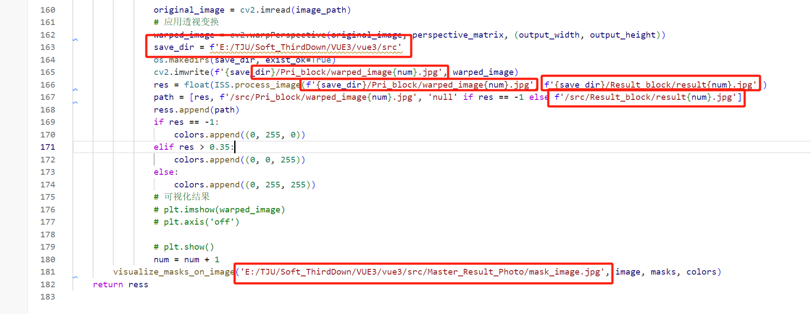

使用Flask框架，运行在8081端口
接口名process_image
参数以json格式，如：

````
{
    "image_path": "006.jpg"
}
````

返回值以json格式，如下：

````
{
   "res": [
      [
         0.1224522370453246,
         "http://localhost:8080/Pri_Block/warped_image1.jpg",
         "http://localhost:8080/Result_Block/result1.jpg"
         "http://localhost:8080/Master_Result_Photo/mask_image_20240601180917.jpg"
      ],
      [
         0.26087444976662955,
         "http://localhost:8080/Pri_Block/warped_image2.jpg",
         "http://localhost:8080/Result_Block/result2.jpg"
         "http://localhost:8080/Master_Result_Photo/mask_image_20240601180917.jpg"
      ]
   ]
}
````
第一个为污渍面积、第二个为分割块映射路径、第三个为识别结果映射路径、第四个为掩码图映射路径

部署可以考虑将yolo识别结果不保存
更改路径，更改predict.py中的路径
--更改save_dir为创建图片仓库的src文件夹地址即可
--更改mapping_dir的域名和端口号即可
